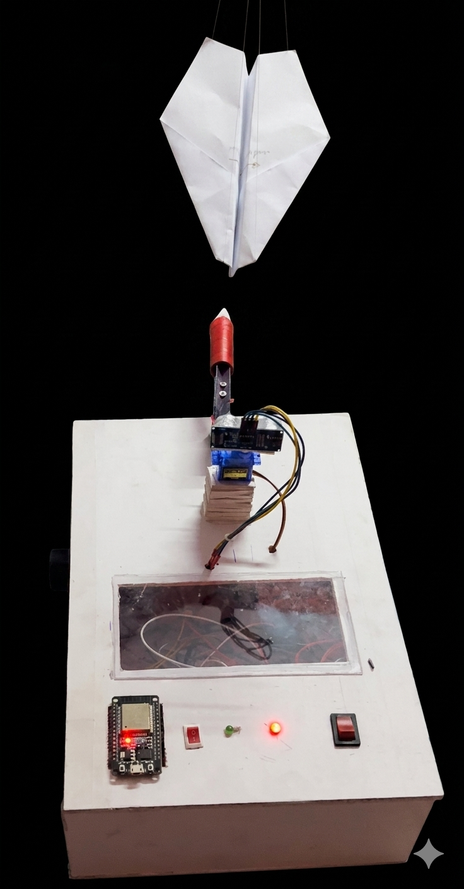
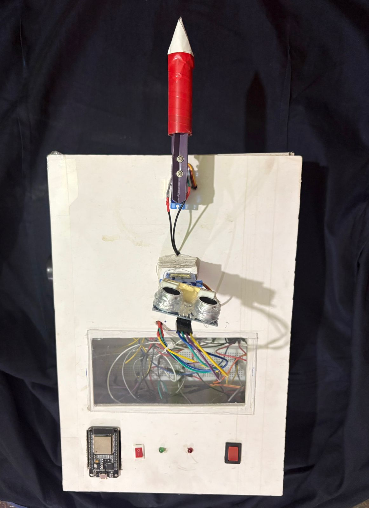
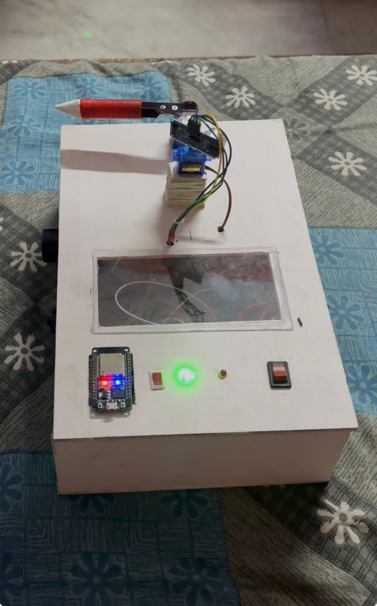
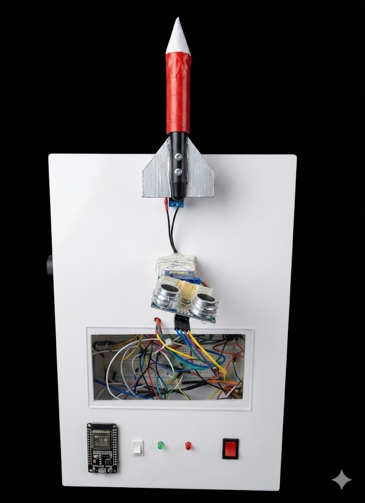
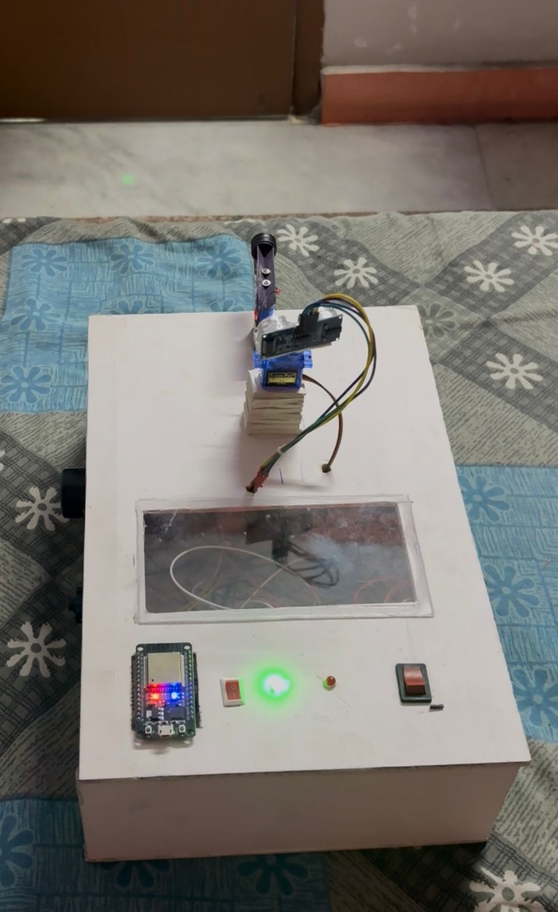
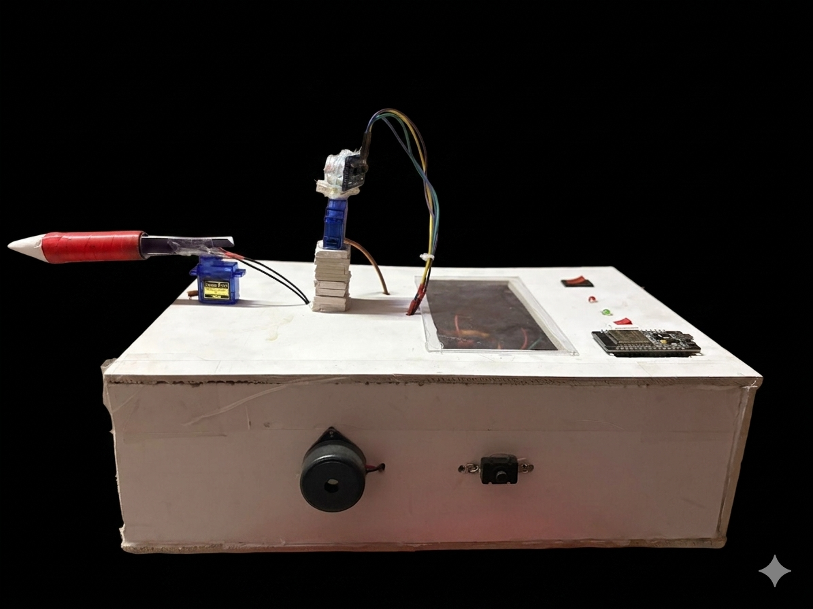
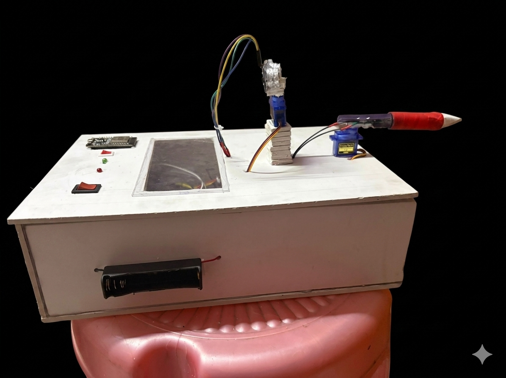
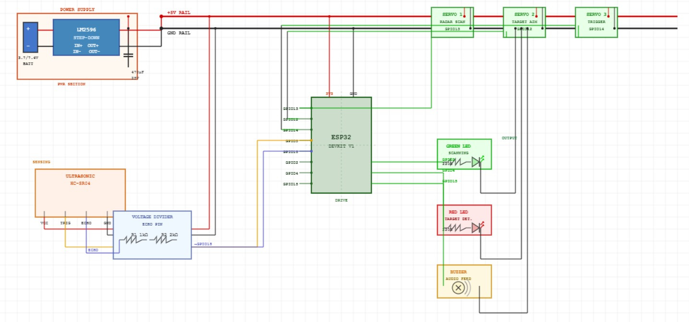
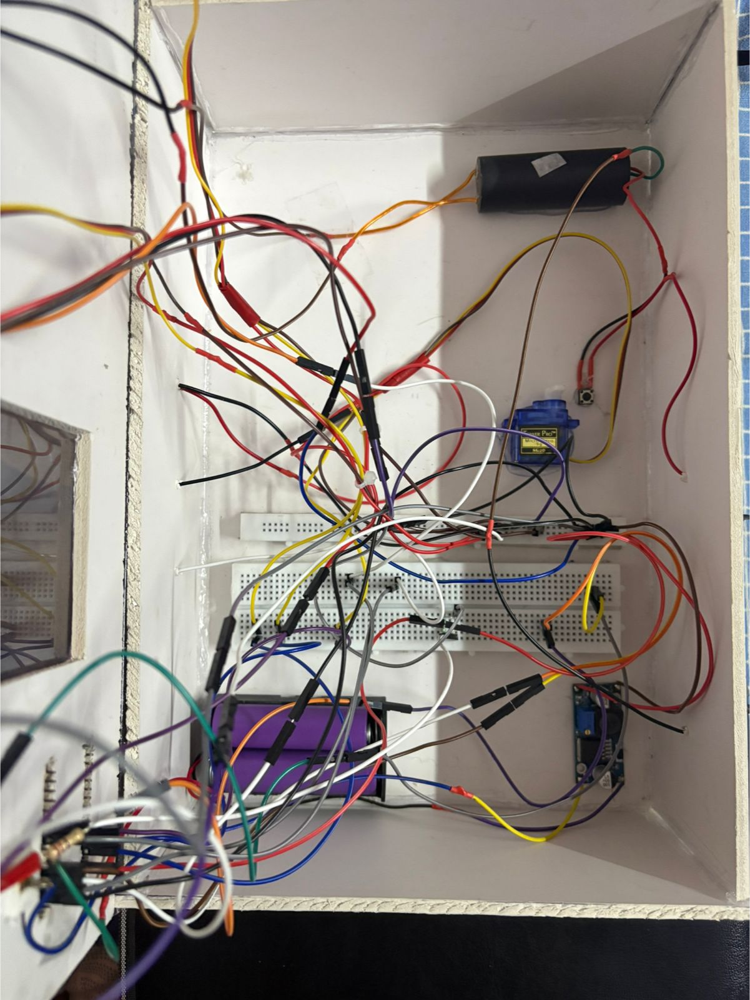

# 🚀 Radar Sensing Missile Launching System (RSML)

### 📡 ESP32-Based Autonomous Radar Tracking & Target Engagement Platform


---

## 🌟 Project Overview

The **Radar Sensing Missile Launching System (RSML)** is an IoT-powered autonomous radar platform capable of scanning, detecting, tracking, and engaging targets using ultrasonic sensing and servo-controlled actuation.

The system continuously sweeps its surroundings using an ultrasonic radar mounted on a rotating servo motor. Once a target is detected, the platform automatically locks the target position, aligns the launcher, activates the trigger mechanism, and resumes scanning after engagement.

### Key Capabilities

* 🎯 Automatic Target Detection
* 📡 180° Radar Scanning
* 🔒 Target Locking
* ⚙️ Servo-Based Aiming
* 🚀 Trigger Activation Mechanism
* 🔊 Audio Alerts
* 💡 Visual Status Indicators
* 🌐 ESP32 Web Dashboard
* 📊 Processing Radar Visualization

---

# 📸 Hardware Showcase

## Complete System

<p align="center">

</p>

---

## Top Views

<p align="center">


</p>

<p align="center">


</p>

---

## Side Views

<p align="center">


</p>

---

# 🔌 Electronics

## Circuit Diagram

<p align="center">

</p>

---

## Wiring Layout

<p align="center">

</p>

---

# ⚙️ System Working

## Step 1 — Radar Scan

The radar servo continuously sweeps from **0° to 180°** while carrying the ultrasonic sensor.

The HC-SR04 sensor measures distance at each angle and sends the data to the ESP32.

---

## Step 2 — Target Detection

When an object enters the configured detection zone:

```text
5 cm < Distance < 40 cm
```

the system identifies it as a potential target.

Actions:

* Distance calculated
* Position recorded
* Buzzer activated
* Target marked

---

## Step 3 — Target Lock

The radar immediately stops scanning.

The detected angle is stored and the launcher system prepares for alignment.

Indicators:

🟢 Green LED OFF

🔴 Red LED ON

---

## Step 4 — Launcher Alignment

The targeting servo rotates the launcher toward the exact angle where the target was detected.

This ensures accurate aiming before activation.

---

## Step 5 — Engagement Sequence

After a confirmation delay:

* Trigger servo activates
* Launcher mechanism engages
* Target sequence completes

```text
DETECT → LOCK → AIM → TRIGGER
```

---

## Step 6 — Reset

After engagement:

* Trigger resets
* Launcher returns
* Radar resumes scanning

The system is now ready for the next target.

---

# 🎬 Demonstration Videos

## Video 1 — Radar Sweep

▶ RESULTS/videos/V1.mp4

Shows continuous radar scanning.

---

## Video 2 — Object Detection

▶ RESULTS/videos/V2.mp4

Demonstrates ultrasonic sensing and object acquisition.

---

## Video 3 — Target Lock

▶ RESULTS/videos/V3.mp4

Shows target locking functionality.

---

## Video 4 — Launcher Tracking

▶ RESULTS/videos/V4.mp4

Demonstrates servo-controlled aiming.

---

## Video 5 — Trigger Activation

▶ RESULTS/videos/V5.mp4

Shows complete engagement sequence.

---

# 🏗️ System Architecture

```text
             HC-SR04 Sensor
                    │
                    ▼

             ESP32 DevKit V1

                    │

     ┌──────────────┼──────────────┐
     │              │              │

     ▼              ▼              ▼

 Radar Servo   Aim Servo     Trigger Servo

                    │

                    ▼

          Launcher Mechanism

                    │

                    ▼

         Target Engagement

                    │

                    ▼

    Processing GUI + Web Dashboard
```

---

# 🔧 Hardware Components

| Component                 | Quantity    |
| ------------------------- | ----------- |
| ESP32 DevKit V1           | 1           |
| HC-SR04 Ultrasonic Sensor | 1           |
| Servo Motor               | 3           |
| Launcher Mechanism        | 1           |
| LM2596 Converter          | 1           |
| Buzzer                    | 1           |
| LEDs                      | 2           |
| Battery Pack              | 1           |
| Push Buttons              | As Required |
| Capacitor                 | 470µF       |
| Jumper Wires              | Multiple    |

---

# 💻 Software & Tools

### Development

* Arduino IDE
* Processing IDE
* GitHub

### Libraries

* WiFi.h
* WebServer.h
* ESP32Servo.h
* Processing Serial Library

---

# 🧑‍💻 Languages Used

| Language   | Purpose             |
| ---------- | ------------------- |
| C++        | ESP32 Firmware      |
| Java       | Processing GUI      |
| HTML       | Dashboard           |
| CSS        | Dashboard Styling   |
| JavaScript | Radar Visualization |

---

# 📂 Project Structure

```text
RESULTS/
├── hardware/
├── videos/
├── circuit.jpeg
├── RSML.pde
├── TRIGGER.ino
└── README.md
```

---

# 🌐 Dashboard Features

* Real-Time Radar Visualization
* Distance Monitoring
* Wireless Access
* ESP32 Hosted Interface
* Live Target Tracking

---

# 🔮 Future Improvements

* AI-Based Target Recognition
* Camera Integration
* Mobile App Control
* Cloud Connectivity
* Computer Vision Tracking
* Long Range Sensors

---

# 👩‍💻 Author

### Sujal Sharma

IoT Developer • Embedded Systems Enthusiast • ESP32 Projects

⭐ If you found this project interesting, consider giving it a star.
